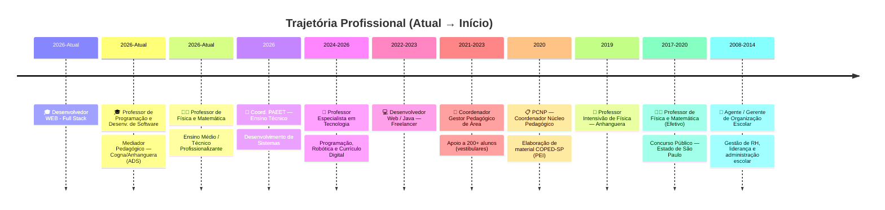

<!-- ╔══════════════════════════════════════════════════════════════════╗ -->
<!-- ║              🚀  DAVI ANTONINO NUNES DA SILVA  🚀              ║ -->
<!-- ║           Desenvolvedor Full Stack · Educador · Inovador        ║ -->
<!-- ╚══════════════════════════════════════════════════════════════════╝ -->

<!-- ============ BANNER ANIMADO ============ -->
<p align="center">
  
</p>

<!-- ============ TYPING ANIMATION ============ -->
<p align="center">
  <a href="https://github.com/dansfisica85">
    
  </a>
</p>

<!-- ============ BADGES DE PERFIL ============ -->
<p align="center">
  
  &nbsp;
  
  &nbsp;
  
</p>

<br/>

<!-- ============ SOBRE MIM ============ -->
<h2>
  
  &nbsp;Sobre Mim
</h2>

```yaml
🧑‍💻 Nome:        Davi Antonino Nunes da Silva
💻 Atuação:      Desenvolvedor WEB Full Stack
🎓 Formação:     Analista e Desenvolvedor de Software — Anhanguera-SP
📚 Cursando:     Engenharia de Software — FIAP (2026–2029)
📜 Extensão:     +140 cursos livres (Alura, DIO, Microsoft, FIAP)
🎯 Foco:         EdTech · AgroTech · Análise de Dados · IA
🏗️ Perfil:       Desenvolvedor Full Stack com projetos reais em produção
🌐 Idiomas:      Português (Nativo) · Inglês · Italiano · Espanhol · Francês
💡 Lema:         "Quando ideias ganham propósito, elas transformam realidades."
📍 Localização:  Sertãozinho - SP, Brasil
```

<br/>

> *Desenvolvedor full-stack com formação multidisciplinar em Física, Matemática, Pedagogia e Engenharia de Software. Mais de **140 repositórios** no GitHub, com projetos completos, documentados e publicados em produção. Experiência real em criar plataformas educacionais, sistemas de análise de dados e soluções com IA — sempre com foco na transformação digital da educação e do agronegócio.*

<br/>

<!-- ============ TECH STACK ============ -->
<h2>
  
  &nbsp;Tech Stack — Full Stack Developer
</h2>

<details open>
<summary><b>🎨 Frontend</b></summary>
<br/>
<p>
  
  
  
  
  
  
  
  
  
  
  
  
</p>
</details>

<details open>
<summary><b>⚙️ Backend & Banco de Dados</b></summary>
<br/>
<p>
  
  
  
  
  
  
  
  
</p>
</details>

<details open>
<summary><b>🤖 IA, Dados & Automação</b></summary>
<br/>
<p>
  
  
  
  
  
  
  
</p>
</details>

<details open>
<summary><b>🔧 DevOps & Ferramentas</b></summary>
<br/>
<p>
  
  
  
  
  
  
  
  
</p>
</details>

<details open>
<summary><b>🖥️ Hardware & Infraestrutura</b></summary>
<br/>
<p>
  
  
  
  
  
  
  
  
</p>
</details>

<br/>

<!-- ============ HABILIDADES FULL STACK ============ -->
<h2>
  
  &nbsp;Habilidades Full Stack
</h2>

<table>
  <tr>
    <td width="50%">
      <h3 align="center">🖥️ Frontend</h3>
      <ul>
        <li>SPAs com <b>Angular 21</b>, Signals & componentes standalone</li>
        <li>Aplicações <b>Next.js 14</b> com SSR e TypeScript</li>
        <li>Dashboards interativos com <b>Chart.js</b> & Canvas 2D</li>
        <li>Interfaces responsivas com <b>Bootstrap</b> & <b>Tailwind CSS</b></li>
        <li>IDE web no navegador com <b>Monaco Editor</b></li>
        <li>Execução de Python client-side com <b>Pyodide</b></li>
      </ul>
    </td>
    <td width="50%">
      <h3 align="center">🔧 Backend</h3>
      <ul>
        <li>APIs REST com <b>Node.js</b> & <b>Express 5</b></li>
        <li>Autenticação <b>JWT</b> + <b>bcrypt</b> + controle por papéis</li>
        <li>Banco de dados <b>SQLite</b> / <b>Turso (libSQL)</b></li>
        <li>Migrations, seeds e variáveis de ambiente</li>
        <li>Deploy serverless na <b>Vercel</b></li>
        <li>Integração com <b>Google Gemini</b> (IA generativa)</li>
      </ul>
    </td>
  </tr>
  <tr>
    <td width="50%">
      <h3 align="center">📊 Dados & IA</h3>
      <ul>
        <li>Análise estatística com <b>Simulação de Monte Carlo</b></li>
        <li><b>RAG</b> — Retrieval-Augmented Generation</li>
        <li><b>OCR</b> com Tesseract.js para extração de texto</li>
        <li>Processamento de PDFs, planilhas e dados estruturados</li>
        <li>KPIs, rankings e comparativos educacionais</li>
        <li>Intervalos de confiança & Box-Muller</li>
      </ul>
    </td>
    <td width="50%">
      <h3 align="center">🔐 Segurança & Arquitetura</h3>
      <ul>
        <li>Controle de acesso: <b>Admin · Coordenador · Aluno</b></li>
        <li>Middleware de autenticação e autorização</li>
        <li>Sessão persistente (LocalStorage / Cookies)</li>
        <li>Deploy contínuo e CI/CD via <b>Vercel</b></li>
        <li>Documentação técnica com <b>Mermaid</b></li>
        <li>Versionamento com <b>Git</b> & <b>GitHub</b></li>
      </ul>
    </td>
  </tr>
  <tr>
    <td width="50%">
      <h3 align="center">🖥️ Hardware & Infraestrutura</h3>
      <ul>
        <li><b>Montagem</b> e configuração completa de computadores</li>
        <li><b>Manutenção preventiva e corretiva</b> de hardware</li>
        <li>Diagnóstico e <b>recuperação</b> de componentes</li>
        <li><b>Upgrade</b> de memória, SSD, GPU, CPU e periféricos</li>
        <li>Formatação e instalação de <b>Windows / Linux</b></li>
        <li>Configuração de <b>redes</b> e infraestrutura local</li>
      </ul>
    </td>
    <td width="50%">
      <h3 align="center">🎓 Educação & Liderança</h3>
      <ul>
        <li>Coordenação pedagógica e <b>gestão escolar</b></li>
        <li>Elaboração de <b>materiais didáticos</b> digitais</li>
        <li>Formação continuada de <b>educadores</b> em tecnologia</li>
        <li>Ensino de <b>Programação, Robótica</b> e Inovação</li>
        <li>Preparação para <b>vestibulares</b> (200+ alunos)</li>
        <li><b>Gamificação</b> e metodologias ativas de ensino</li>
      </ul>
    </td>
  </tr>
</table>

<br/>

<!-- ============ PROJETOS EM DESTAQUE ============ -->
<h2>
  
  &nbsp;Projetos em Destaque
</h2>

<!-- PROJETO 1 -->
<details open>
<summary>
  <b>🏆 ADS Anhanguera — Plataforma Educacional Full Stack</b>
  &nbsp;
  
</summary>
<br/>
<p align="center">
  <a href="https://github.com/dansfisica85/adsanhanguera">
    
  </a>
  &nbsp;
  <a href="https://ads26-anhanguera.vercel.app">
    
  </a>
</p>

> Plataforma educacional **full-stack** para o curso de ADS da Anhanguera. Autenticação JWT, papéis de usuário, exercícios interativos, avaliação automática, IDE web (Monaco Editor), execução de Python via Pyodide, ranking gamificado, painel administrativo e biblioteca de documentos.

<p>
  
  
  
  
  
  
  
  
</p>
</details>

<!-- PROJETO 2 -->
<details open>
<summary>
  <b>🎯 Escopos 2026 — Plataforma Educacional Angular</b>
  &nbsp;
  
</summary>
<br/>
<p align="center">
  <a href="https://github.com/dansfisica85/Escopos-2026">
    
  </a>
  &nbsp;
  <a href="https://pec-tecnologia-davi.vercel.app">
    
  </a>
</p>

> Plataforma web interativa para consulta de escopos e sequências didáticas. **Angular 21** com Signals, componentes standalone, rotas, filtros em cascata e grande volume de dados educacionais estruturados.

<p>
  
  
  
  
  
</p>
</details>

<!-- PROJETO 3 -->
<details open>
<summary>
  <b>🌾 AetherAgri · Gaya-Link — Global Solution FIAP</b>
  &nbsp;
  
</summary>
<br/>
<p align="center">
  <a href="https://github.com/dansfisica85/aetheragri">
    
  </a>
  &nbsp;
  <a href="https://aetheragri.vercel.app">
    
  </a>
</p>

> Ecossistema **Space-Agri** com dados de satélite, hardware IoT e IA aplicada à agricultura. Live Orbit Map, NDVI Heatmap, Climate Forecast, telemetria ao vivo, simulador de risco de pragas e feed de alertas.

<p>
  
  
  
  
  
</p>
</details>

<!-- PROJETO 4 -->
<details>
<summary>
  <b>🤖 SAEB Coordenador — Sistema com IA Generativa</b>
  &nbsp;
  
</summary>
<br/>
<p align="center">
  <a href="https://github.com/dansfisica85/SAEB---COORDENADOR">
    
  </a>
  &nbsp;
  <a href="https://saeb-coordenador-manual.vercel.app">
    
  </a>
</p>

> Sistema de pesquisa e consulta de documentos do SAEB com **Google Gemini**, busca semântica (RAG), OCR, chat com IA e referências a páginas e slides.

<p>
  
  
  
  
  
</p>
</details>

<!-- PROJETO 5 -->
<details>
<summary>
  <b>📊 Análise REGINA — Estatística Educacional (Monte Carlo)</b>
  &nbsp;
  
</summary>
<br/>
<p align="center">
  <a href="https://github.com/dansfisica85/REGINA---ANUAL">
    
  </a>
  &nbsp;
  <a href="https://analise-regina-anual.vercel.app">
    
  </a>
</p>

> Análise estatística educacional com **Método Monte Carlo**, rankings interativos, gráficos comparativos, intervalos de confiança de 95% e dashboard por escola.

<p>
  
  
  
  
</p>
</details>

<!-- PROJETO 6 -->
<details>
<summary>
  <b>📋 Sistema REGINA 2025 — Dashboard Super BI</b>
</summary>
<br/>
<p align="center">
  <a href="https://github.com/dansfisica85/Analise-REGINA">
    
  </a>
  &nbsp;
  <a href="analise-regina-read.vercel.app">
    
  </a>
</p>

> Sistema completo de análise educacional: dashboard, KPIs dinâmicos, simulador Super BI, análise de 26 escolas, planos de ação automatizados e gráficos interativos.

<p>
  
  
  
  
  
</p>
</details>

<!-- MAIS PROJETOS -->
<details>
<summary>
  <b>📁 Outros Projetos</b>
</summary>
<br/>

| Projeto | Repositório | Deploy |
|---------|------------|--------|
| 🎓 Portal de Programação e Robótica | [Repositório](https://github.com/dansfisica85/Programacao-e-Robotica) | — |
| 🎤 Site Anhanguera — Palestra | [Repositório](https://github.com/dansfisica85/Site-Anhaguera---Palestra) | [Live](https://curriculo-empreender.vercel.app) |
| 💼 Juliana — Portfólio | [Repositório](https://github.com/dansfisica85/juliana) | [Live](https://julianabalbino.vercel.app) |

</details>

<br/>

<!-- ============ EXPERIÊNCIA PROFISSIONAL ============ -->
<h2>
  
  &nbsp;Experiência Profissional
</h2>



<br/>

<!-- ============ FORMAÇÃO ACADÊMICA ============ -->
<h2>🎓 Formação Acadêmica</h2>

| 📅 Período | 🏛️ Instituição | 📜 Curso | 📋 Tipo |
|:---------:|:-------------:|:-------:|:------:|
| 2026–2029 | **FIAP** | 🎯 Engenharia de Software | Bacharelado (em curso) |
| 2022–2024 | **Anhanguera** | 💻 Análise e Desenvolvimento de Sistemas | Tecnólogo |
| 2020–2021 | **UniFatecie** | 📚 Pedagogia — Educação Infantil | Licenciatura |
| — 2015 | **UNIMES** | 🔭 Física | Licenciatura |
| — 2024 | **UNIFATECIE** | 🏫 Gestão Escolar | Pós-Graduação (Lato Sensu) |
| 2017–2019 | **UFSCar** | 📐 Ensino de Matemática no Ensino Médio | Pós-Graduação (Lato Sensu) |
| 2017–2019 | **São Luís de Jaboticabal** | 🔬 Ensino de Matemática e Física | Pós-Graduação (Lato Sensu) |

<br/>

<!-- ============ CERTIFICAÇÕES ============ -->
<h2>📜 Certificações & Cursos</h2>

<p align="center">
  
  
  
  
</p>

<p align="center">
  <b>+140 cursos livres de extensão</b> em Desenvolvimento Web, IA, Cloud, Dados, Segurança e Design
</p>

<br/>

<!-- ============ IDIOMAS ============ -->
<h2>🌍 Idiomas</h2>

<p align="center">
  
  
  
  
  
</p>

<br/>

<!-- ============ DOMÍNIOS DE ATUAÇÃO ============ -->
<h2>🌐 Domínios de Atuação</h2>

<p align="center">
  
  
  
  
  
  
</p>

<br/>

<!-- ============ GITHUB STATS ============ -->
<h2>
  
  &nbsp;GitHub Stats
</h2>

<p align="center">
  
  &nbsp;
  
</p>

<p align="center">
  
</p>

<p align="center">
  
</p>

<br/>

<!-- ============ TROFÉUS ============ -->
<p align="center">
  
</p>

<br/>

<!-- ============ CONTATO ============ -->
<h2>
  
  &nbsp;Vamos Conectar!
</h2>

<p align="center">
  <a href="https://www.linkedin.com/in/davinunesdasilva">
    
  </a>
  &nbsp;
  <a href="mailto:professordavi85@gmail.com">
    
  </a>
  &nbsp;
  <a href="https://github.com/dansfisica85">
    
  </a>
</p>

<br/>

<!-- ============ SNAKE ANIMATION ============ -->
<p align="center">
  
</p>

<!-- ============ FOOTER ============ -->
<p align="center">
  
</p>

<p align="center">
  <i>⚡ "Quando ideias ganham propósito, elas transformam realidades." ⚡</i>
</p>
