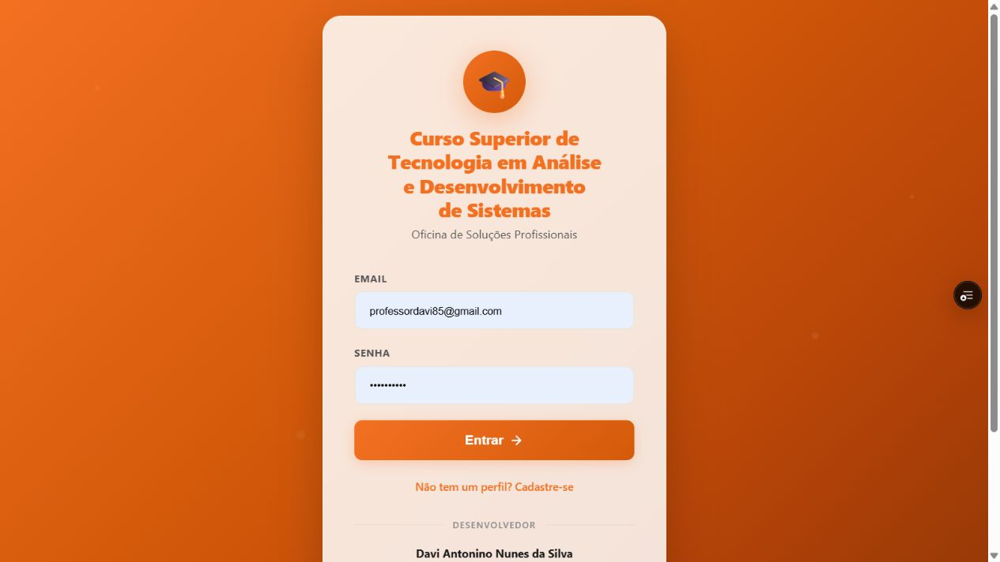
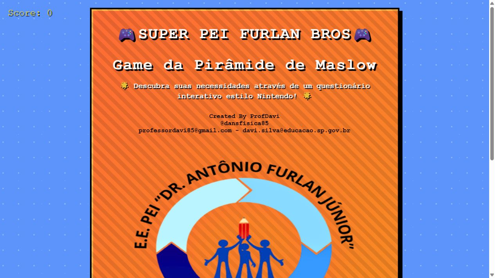

# Davi Antonino Nunes da Silva

## Desenvolvedor Web Full Stack com foco em JavaScript

**JavaScript · TypeScript · Node.js · HTML · CSS · Turso · Deploy · Python**

[Portfólio e currículo](https://profdavi-curriculo.vercel.app/) · [LinkedIn](https://www.linkedin.com/in/davinunesdasilva/) · [Contato](mailto:professordavi85@gmail.com)

## O que faço e o que ofereço

Sou desenvolvedor web Full Stack com foco no ecossistema JavaScript. Transformo necessidades reais em plataformas educacionais, interfaces interativas, jogos e dashboards, conectando front-end, APIs, banco de dados e publicação na web.

Meu ponto forte é desenvolver com JavaScript, TypeScript, Node.js, HTML e CSS, trabalhar com Turso e levar uma aplicação até o deploy. Python, análise de dados e raciocínio matemático complementam essa atuação. Quero contribuir com uma equipe de tecnologia, construir novos projetos e continuar aprendendo com desafios reais.

Atuo também como Professor Mediador no curso de Análise e Desenvolvimento de Sistemas da Anhanguera, em Sertãozinho. Essa vivência aproxima meu desenvolvimento das necessidades dos usuários e fortalece minha comunicação, minha didática e minha capacidade de transformar problemas em soluções utilizáveis.

## Hard skills · competência aplicada em projetos

Meu principal domínio técnico é o ecossistema JavaScript. Estas são as habilidades que aplico nas minhas entregas.

### JavaScript e interfaces web

Desenvolvimento de interfaces, formulários, interações e lógica de aplicação com JavaScript, TypeScript, HTML5 e CSS3. Uso de Angular, React/Next.js e Svelte conforme o projeto, além de componentes reutilizáveis e layouts responsivos.

*Aplicação prática: ADS26, Escopos 2026 e Super Furlan Bros.*

### Node.js, APIs e integrações

Criação de serviços com Node.js e Express, rotas e APIs REST, integração entre front-end e back-end, autenticação e controle de acesso por perfis. Conexão de recursos e serviços externos às necessidades da aplicação.

*Aplicação prática: serviços e funcionalidades da plataforma ADS26.*

### Turso, SQL e persistência

Uso frequente de Turso/libSQL e SQLite: criação e organização de tabelas, consultas SQL, operações de cadastro, leitura, atualização e exclusão de dados, além de integração do banco com a aplicação.

*Aplicação prática: persistência de usuários, respostas e projetos no ADS26.*

### Git, deploy e manutenção

Versionamento com Git/GitHub, organização de dependências, configuração de variáveis de ambiente e publicação na Vercel. Acompanhamento do deploy, investigação de erros e evolução das aplicações depois da entrega.

*Aplicação prática: publicação e manutenção dos meus projetos web.*

### Python, planilhas e análise de dados

Conhecimento sólido em Python, facilidade com planilhas, fórmulas, cálculos e pensamento abstrato. Uso desses recursos para análise de dados, scripts e automação, organização de informações e construção de indicadores, comparativos e dashboards.

*Aplicação prática: análises educacionais e dashboards dos projetos REGINA.*

### Hash, criptografia e proteção de dados

Conhecimento do algoritmo SHA-256 e de seu uso em verificações de integridade. Interesse em compreender e aplicar técnicas de criptografia de dados, estudando suas finalidades e limitações. Distingo hash, uma função de resumo, de criptografia reversível com chave.

*Conhecimento técnico complementar; aprofundamento contínuo em proteção de dados.*

### IA integrada ao desenvolvimento

Facilidade para conectar ferramentas e recursos de IA ao fluxo de programação e integrar assistentes às aplicações. Uso de IA para apoiar pesquisa, implementação, testes, revisão de código, documentação e exploração de soluções.

*Aplicação prática: meu fluxo de desenvolvimento e o assistente integrado ao ADS26.*

## Soft skills · como trabalho

### Aprendizado rápido e contínuo

Tenho grande facilidade e entusiasmo para aprender. Diante de uma tecnologia ou problema novo, pesquiso, consulto documentação, experimento e aplico o conhecimento em uma solução concreta.

### Criatividade na resolução de problemas

Exploro alternativas, conecto conhecimentos de áreas diferentes e decomponho desafios em etapas. Mesmo sem uma resposta inicial, consigo começar pela investigação e avançar com hipóteses, protótipos e validação.

### Adaptabilidade e atuação sob pressão

Adapto-me a mudanças, situações de conflito e desafios. Busco manter clareza, diálogo e organização sob pressão, revendo prioridades e comunicando dificuldades para construir uma solução.

### Comunicação interpessoal

Explico ideias e decisões técnicas de forma acessível, escuto diferentes perspectivas e procuro alinhar expectativas. Minha experiência como professor fortalece o compartilhamento de conhecimento e o apoio a outras pessoas.

### Trabalho em equipe e compromisso com entregas

Assumo responsabilidade pela parte que me cabe no projeto e valorizo colaboração, feedback e transparência. Tenho afinidade com a dinâmica Scrum: alinhar tarefas, compartilhar progresso, sinalizar impedimentos e participar das entregas da equipe.

### Iniciativa e entusiasmo por tecnologia

Tenho muita vontade de participar de equipes de tecnologia, criar projetos novos e ampliar meu repertório. Gosto de transformar curiosidade em experimentação e conhecimento em melhorias úteis para o projeto.

## IA como ferramenta de trabalho

Acompanho a evolução das ferramentas de IA e busco utilizar recursos modernos e atualizados, escolhendo a ferramenta de acordo com a tarefa. Integro essas ferramentas ao meu fluxo para otimizar tempo, esclarecer dúvidas, gerar ideias, explorar implementações e apoiar a criação de testes e a revisão de código.

Uso a IA como ferramenta de trabalho, com análise crítica e responsabilidade técnica. As sugestões passam por revisão e validação: testes, verificação de comportamento e análise de possíveis problemas de segurança fazem parte da entrega. A ferramenta apoia o processo; a decisão e a validação continuam sob minha responsabilidade.

## Outras tecnologias · estudos e experiência inicial

C#, .NET, Java, Spring Boot, PHP e C++ fazem parte dos meus estudos e contatos anteriores. Também tenho conhecimentos complementares em SQL Server, Oracle, AWS e Azure. Minha experiência prática varia entre essas tecnologias; elas não representam o mesmo nível de domínio e entrega que tenho no ecossistema JavaScript. Python complementa minhas competências fortes em programação e dados.

Ainda não apresento projetos robustos nas demais linguagens como minha principal experiência profissional. Quando um projeto exige uma nova tecnologia, estou disposto a estudar, praticar e desenvolver a competência necessária para contribuir com responsabilidade.

Minha formação multidisciplinar em Física, Matemática e Educação complementa a programação com raciocínio lógico, análise quantitativa e didática.

---

## 🚀 Projetos em Destaque

### ADS26 Anhanguera · plataforma para ensinar e praticar programação

[Ver código e documentação](https://github.com/dansfisica85/adsanhanguera) · [Acessar plataforma](https://ads26-anhanguera.vercel.app/)

**Contexto:** Desenvolvi a plataforma para apoiar minhas aulas no curso de ADS da Anhanguera e a prática de programação dos meus alunos, especialmente JavaScript.

**O que construí:** Uma aplicação Full Stack com autenticação e perfis de acesso, exercícios, avaliação automática, editor de código no navegador com preview, projetos de alunos, dashboards, biblioteca de materiais e assistente de IA integrado.

**Tecnologias aplicadas:** JavaScript, HTML, CSS, Node.js, Express, Turso/libSQL, SQL, APIs, Monaco Editor e deploy na Vercel.

**O que posso oferecer a uma equipe:** Capacidade de transformar uma necessidade de uso em fluxos de interface, serviços, dados persistidos e uma aplicação publicada que pode continuar evoluindo.



*ADS26: tela pública de acesso. Áreas de alunos e administração exigem autenticação.*

### Super Furlan Bros · questionário educacional gamificado

[Ver código e documentação](https://github.com/dansfisica85/Super-Furlan-Bros)

**Contexto:** Criei um jogo educacional com questionário gamificado inspirado na Hierarquia de Necessidades de Maslow, voltado à escuta e ao acompanhamento de crianças e adolescentes.

**O que desenvolvi:** Organização de 30 perguntas em cinco níveis, lógica de respostas e pontuação, transições, feedback visual e geração de relatórios descritos no código do projeto.

**Finalidade:** Apoiar a identificação de possíveis vulnerabilidades a partir das respostas e orientar a atenção de educadores. É um recurso educacional de apoio, sem substituir avaliação humana ou diagnóstico profissional.

**Tecnologias aplicadas:** HTML, CSS e JavaScript com ES Modules: lógica de aplicação, manipulação da interface, cálculos e estruturação de informações.

**O que posso oferecer a uma equipe:** Criatividade para transformar uma proposta pedagógica em experiência interativa e capacidade de conectar regras, conteúdo, dados e interface.



*Super Furlan Bros: tela inicial capturada em prévia local do código. Demonstração pública indisponível nesta revisão.*

### Outras aplicações do meu repertório

<details open>
<summary>🎯 <b>Escopos 2026 — Plataforma Educacional Angular</b></summary>

<br/>

📂 [Repositório](https://github.com/dansfisica85/Escopos-2026) · 🌐 [Live Demo](https://pec-tecnologia-davi.vercel.app)

Plataforma web interativa para consulta de escopos e sequências didáticas. **Angular 21** com Signals, componentes standalone, rotas, filtros em cascata e grande volume de dados educacionais estruturados.


</details>

<details open>
<summary>🌾 <b>AetherAgri · Gaya-Link — Global Solution FIAP</b></summary>

<br/>

📂 [Repositório](https://github.com/dansfisica85/aetheragri) · 🌐 [Live Demo](https://aetheragri.vercel.app)

Ecossistema **Space-Agri** com dados de satélite, hardware IoT e IA aplicada à agricultura. Live Orbit Map, NDVI Heatmap, Climate Forecast, telemetria ao vivo, simulador de risco de pragas e feed de alertas.


</details>

<details>
<summary>🤖 <b>SAEB Coordenador — Sistema com IA Generativa</b></summary>

<br/>

📂 [Repositório](https://github.com/dansfisica85/SAEB---COORDENADOR) · 🌐 [Live Demo](https://saeb-coordenador-manual.vercel.app)

Sistema de pesquisa e consulta de documentos do SAEB com **Google Gemini**, busca semântica (RAG), OCR, chat com IA e referências a páginas e slides.


</details>

<details>
<summary>📊 <b>Análise REGINA — Estatística Educacional (Monte Carlo)</b></summary>

<br/>

📂 [Repositório](https://github.com/dansfisica85/REGINA---ANUAL) · 🌐 [Live Demo](https://analise-regina-anual.vercel.app)

Análise estatística educacional com **Método Monte Carlo**, rankings interativos, gráficos comparativos, intervalos de confiança de 95% e dashboard por escola.


</details>

<details>
<summary>📋 <b>Sistema REGINA 2025 — Dashboard Super BI</b></summary>

<br/>

📂 [Repositório](https://github.com/dansfisica85/Analise-REGINA) · 🌐 [Live Demo](https://analise-regina-read.vercel.app)

Sistema completo de análise educacional: dashboard, KPIs dinâmicos, simulador Super BI, análise de 26 escolas, planos de ação automatizados e gráficos interativos.


</details>

<details>
<summary>🏎️ <b>Simulador de Corridas do Mario Kart (Node.js)</b></summary>

<br/>

📂 [Repositório](https://github.com/dansfisica85/Mario-Kart-DIO)

Projeto DIO de simulador de corridas do Mario Kart desenvolvido com **Node.js** e **JavaScript**. Projeto pronto.


</details>

<details>
<summary>📁 <b>Outros Projetos</b></summary>

<br/>

| Projeto | Repositório | Deploy |
|---|---|---|
| 🎓 Portal de Programação e Robótica | [Repositório](https://github.com/dansfisica85/Programacao-e-Robotica) | — |
| 🎤 Site Anhanguera — Palestra | [Repositório](https://github.com/dansfisica85/Site-Anhaguera---Palestra) | [Live](https://curriculo-empreender.vercel.app) |
| 💼 Juliana — Portfólio | [Repositório](https://github.com/dansfisica85/juliana) | [Live](https://julianabalbino.vercel.app) |

</details>

---

## 💼 Experiência Profissional — Linha do Tempo

```text
2026-Atual: 🎓 Desenvolvedor WEB - Full Stack
2026-Atual: 🎓 Professor de Programação e Desenv. de Software
           : Mediador Pedagógico — Cogna/Anhanguera (ADS)
2026-Atual: 👨‍🏫 Professor de Física e Matemática
           : Ensino Médio / Técnico Profissionalizante
2026      : 📐 Coord. PAEET — Ensino Técnico
           : Desenvolvimento de Sistemas
2024-2026 : 🤖 Professor Especialista em Tecnologia
           : Programação, Robótica e Currículo Digital
2022-2023 : 💻 Desenvolvedor Web / Java — Freelancer
2021-2023 : 🏢 Coordenador Gestor Pedagógico de Área
           : Apoio a 200+ alunos (vestibulares)
2020      : 📋 PCNP — Coordenador Núcleo Pedagógico
           : Elaboração de material COPED-SP (PEI)
2019      : 🎯 Professor Intensivão de Física — Anhanguera
2017-2020 : 👨‍🏫 Professor de Física e Matemática (Efetivo)
           : Concurso Público — Estado de São Paulo
2008-2014 : 🏫 Agente / Gerente de Organização Escolar
           : Gestão de RH, liderança e administração escolar
```
---
## 🎓 Formação Acadêmica

| Período | Instituição | Curso | Tipo / Nível |
|---|---|---|---|
| Conclusão prevista: out/2026 | **Anhanguera Educacional** | 📊 MBA em Inteligência de Dados Aplicada à Negócios | Pós-Graduação — MBA (em andamento) |
| fev 2026 – fev 2029 | **FIAP** | 🎯 Engenharia de Software (Computer Software Engineering) | Bacharelado em Engenharia (em curso) |
| jul 2022 – jun 2024 | **Anhanguera Educacional** | 💻 Análise e Desenvolvimento de Sistemas (CST) | Tecnólogo (Concluído) |
| fev 2024 – jul 2024 | **Centro Universitário UniFatecie** | 🏫 Gestão Escolar | Pós-Graduação Lato Sensu (Concluído) |
| ago 2020 – ago 2021 | **Centro Universitário UniFatecie** | 📚 Pedagogia — Educação Infantil (Kindergarten/Preschool Education and Teaching) | Licenciatura |
| jan 2017 – dez 2019 | **UFSCar - Alumni** | 📐 Ensino de Matemática no Ensino Médio | Pós-Graduação Lato Sensu (Especialização) |
| jan 2017 – dez 2019 | **Faculdade São Luís de Jaboticabal** | 🔬 Ensino de Matemática e Física | Pós-Graduação Lato Sensu (Especialização) |
| jun 2013 – ago 2015 | **Universidade Metropolitana de Santos (UNIMES)** | 🔭 Física (Exatas) | Licenciatura Plena |
| nov 2023 – o momento | **DIO** | 📜 Formação contínua (Avaliação educacional, AWS CloudFormation e mais 29 competências) | Educação Continuada |
| nov 2022 – nov 2023 | **Alura** | 📜 Formação contínua (Realização de testes, Software Development e mais 14 competências) | Educação Continuada |

> **UNIMES — Atividades e grupos:** Laboratório de Programação; Laboratório de Eletrônica; Estágio em Sala de aula. Competências: vestibular, Gestão de pessoas e mais 8 competências.

---

## 📜 Licenças e Certificados (Lista Completa)


<div align="center">


</div>

<details open>
<summary>🏆 <b>2026 · FIAP</b></summary>

<br/>

| Certificado | Instituição | Data | Credencial / Competências |
|---|---|---|---|
| Comunicação | FIAP | fev/2026 | `f585c60ed1e0dfd9267e50d00dee4a63` · Comunicação |

</details>

<details>
<summary>📅 <b>2024 · DIO · Alura · Microsoft · UniFatecie</b></summary>

<br/>

| Certificado | Instituição | Data | Credencial / Competências |
|---|---|---|---|
| Simulador de Corridas do Mario Kart com Node.js | DIO | out/2024 | `FSUBZBPH` · Node.js, JavaScript |
| Android Studio | DIO | out/2024 | `T21WHR0M` · Android, Desenvolvimento Android +1 |
| Inicializando Projetos Node.js | DIO | ago/2024 | Node.js |
| Pensamento Computacional na Educação Básica | Alura | jul/2024 | `5d335385-615a-4fac-8ded-a2ed856b60b4` |
| Instalando Ambiente de Desenvolvimento Node.js | DIO | jul/2024 | `G2BTY6OM` · Node.js |
| Bem-vindo ao mundo do NODE.JS | DIO | jul/2024 | `NBA04BWX` · Node.js |
| Módulo 5 - English4Tech | DIO | jul/2024 | `NRLDY737` · Inglês, Inglês para negócios +1 |
| Python e APIs: conhecendo a biblioteca Requests | Alura | jun/2024 | `aa7770ef-b1a8-4152-a90a-b79926986585` |
| Listas: criando o seu jogo de cartas com listas e padrões | Alura | jun/2024 | `192ad498-d58b-462e-b2fb-5ea6ab1d1170` · JavaScript |
| Funções: desenvolvendo um recomendador de filmes com JavaScript | Alura | jun/2024 | `493af831-95a8-4b0d-98eb-012860356134` · JavaScript |
| Bem-Vindo ao Mundo do Node.js | DIO | jun/2024 | `NBA04BWX` · Node.js |
| Aceleração Internacional - Implementing AI for Emotion Detection | DIO | jun/2024 | `ZGZBTPOH` |
| Aceleração Internacional - Implementing AI for Emotion Detection | DIO | jun/2024 | `UBO0AQJA` |
| Technical Evaluation of Created Models and Ethical Issues | DIO | jun/2024 | `LRUWLXV8` |
| Hands-On: Implementing AI with Python | DIO | jun/2024 | `FFJJPYFP` |
| The Impact of Emotions on Decision-Making | DIO | jun/2024 | `6ABKDUFT` · Tomada de decisão |
| Conectando-se ao Mundo Profissional: Tecnologia, Currículo e Entrevista | Alura | mai/2024 | `95d1c773-7289-4d0c-abb4-660663403289` |
| Repositório digital: aprenda a compartilhar seus projetos | Alura | mai/2024 | `ac527138-b516-432d-8424-b0af56226ae6` · GitHub |
| Linguagem de programação: criando projetos artísticos com Javascript | Alura | mai/2024 | `cdc1de01-dda7-4c5d-9d9f-d0801493c6c0` |
| Lógica de programação: desenvolvendo um jogo estilo Pong | Alura | mai/2024 | `ab630fdb-40c0-43fc-8653-ef84a8d88514` |
| Microsoft Certified: Azure AI Fundamentals | Microsoft | mai/2024 | Microsoft Azure Machine Learning |
| Microsoft Azure AI Fundamentals AI-900 | DIO | abr/2024 | `UKFIVT12` · Azure ML |
| Explorando os Recursos de IA Generativa com Copilot e OpenAI | DIO | abr/2024 | `7NQQDCRC` · Azure ML |
| Fundamentos da IA Generativa | DIO | abr/2024 | `Y0MTYCO9` · Azure ML |
| Azure Cognitive Search: AI Search para indexação e consulta de Dados | DIO | abr/2024 | `QGXKR2H1` · Azure Functions, Azure ML |
| Análise de Sentimentos com Language Studio no Azure AI | DIO | abr/2024 | `ORY1RATD` · Azure ML, Azure DevOps Server +3 |
| Language Studio: Sentiment and opinion mining tryout | — | abr/2024 | — |
| TRILHA DO FUTURO: Dominando o ChatGPT para Turbinar sua Produtividade | Centro Universitário UniFatecie | mar/2024 | ChatGPT · RA 37110 |
| Fundamentos do Serviço Azure OpenAI | DIO | mar/2024 | `CD0OVY5F` · Azure ML |
| Inteligência de Documentos de IA do AZURE | DIO | mar/2024 | `UYJQAGQF` · machine Learning, Azure ML |
| Módulo 4 - Participando da sua primeira entrevista internacional | DIO | mar/2024 | `KON3XRMO` · ESL, Inglês para negócios +2 |
| Conceitos de Processamento de Linguagem Natural | DIO | mar/2024 | `LLW98FKN` · Aprendizado de máquina, ML |
| Reconhecimento Facial e transformação de imagens em Dados no Azure ML | DIO | fev/2024 | `KLKCYFUW` · Análise de dados, Azure ML |
| Módulo 3 - Desenvolvendo a Sua Rede de Contatos Profissionais | DIO | fev/2024 | `M8YJDMFB` · Inglês |
| Fundamentos do Aprendizado de Máquina | DIO | fev/2024 | `JBPBRJD6` · Azure ML |
| Contribuindo em um Projeto Open Source no GitHub | DIO | jan/2024 | `63BFAEF2` · Azure ML, GitHub +2 |
| Conceitos Fundamentais de IA | DIO | jan/2024 | `95DF1C36` · Computação em nuvem, C# +1 |
| SQL Server - Dominando Tabelas e Tipos de Dados | DIO | jan/2024 | `13CC3D7E` · SQL Server Management Studio, SQL |
| Módulo 1 - Preparando-se Para Uma Oportunidade Internacional | DIO | jan/2024 | `B0CB286A` · Inglês |
| Módulo 2 - Conhecendo Empresas E Oportunidades Internacionais | DIO | jan/2024 | `3B87AB80` · Inglês |
| Introdução Banco de Dados | DIO | jan/2024 | `7E590F00` · Banco de dados, Desenvolvimento de sistemas |
| Programação Orientada a Objetos com C# | DIO | jan/2024 | `58FEDE2F` · Computação, C# +1 |
| Decola Tech 2024 | DIO | jan/2024 | `ED67A934` · Boot Camp, Computação +1 |
| Orientação a Objetos com C# | DIO | jan/2024 | `BE5B9D2D` · C#, Desenv. de sistemas |
| Implementando Validações de Testes Unitários com C# | DIO | jan/2024 | `B0D86E7B` · Teste de unidade +1 |
| Testes Unitários com C# | DIO | jan/2024 | `B357FA62` · Teste de unidade, Unix +2 |
| Testes Unitários com C# | DIO | jan/2024 | `8357FA62` · Computação, Desenv. de sistemas +1 |
| Praticando Orientação a Objetos Com Desafios de Código em C# | DIO | jan/2024 | `61B01AEF` · C#, Desenv. de sistemas |
| Classes Abstratas e Interfaces com C# | DIO | jan/2024 | `E79FAEB0` · Computação, C# +1 |
| Herança e Polimorfismo com C# | DIO | jan/2024 | `1A9F5D12` · Computação / Gestão de projetos +1 |
| Conhecendo o Processo de Mobilidade Global: da Imigração ao Aluguel | DIO | jan/2024 | `C94FA5E3` · Desenv. de sistemas |
| Introdução, Abstração e Encapsulamento com C# | DIO | jan/2024 | `088A362B` · Computação, C# / Treinamento +1 |
| Criando um Sistema e Abstraindo um Celular com POO em C# | DIO | jan/2024 | `EB721A6E` · Gestão de projetos, Computação +1 |

</details>

<details>
<summary>📅 <b>2023 · DIO · Alura · Ada · Anhanguera</b></summary>

<br/>

| Certificado | Instituição | Data | Credencial / Competências |
|---|---|---|---|
| Convenções C# Com Desafios de Código | DIO | dez/2023 | `C756E6EC` · C#, Desenv. de sistemas |
| Explorando a linguagem C# | DIO | dez/2023 | `5B341A1D` · C#, Desenv. de sistemas |
| Construindo um Sistema de Hospedagem de um Hotel no C# | DIO | dez/2023 | `6FEC7C45` · Computação, C# +1 |
| Stack, Heap e Garbage Collector no C# | DIO | dez/2023 | `75F26E1E` · C#, Desenv. de sistemas |
| Desafios de Código: Aperfeiçoe Sua Lógica e Pensamento Computacional | DIO | dez/2023 | `51C7ACDC` · Programação lógica, Computação +1 |
| Tipos Especiais no C# | DIO | dez/2023 | `78B941D3` · C#, Desenv. de sistemas |
| Pottencial Dev Week | DIO | dez/2023 | `7833C704` · Coaching, Desenv. de sistemas |
| Nuget, Serializar e Atributos no C# | DIO | dez/2023 | `84E3A156` · C#, Desenv. de sistemas |
| Materiais complementares: Explorando a Linguagem C# | DIO | dez/2023 | `599C30D0` · C#, Desenv. de sistemas |
| Tuplas, Operador Ternário e Desconstrução de um Objeto com C# | DIO | dez/2023 | `A32F0F4B` · C#, Desenv. de sistemas |
| Dominando a Linguagem de Programação C# | DIO | dez/2023 | `011ED6A2` · C#, Desenv. de sistemas |
| Primeiros Passos na Linguagem de Programação C# | DIO | dez/2023 | `068D0924` · C#, Desenv. de sistemas |
| Exceções e Coleções com C# | DIO | dez/2023 | `C22C6AA0` · C#, Desenv. de sistemas |
| Aceleração Internacional - Scaling Trending Topics with Spring and AWS | DIO | dez/2023 | `0EF8E6BC` · AWS CloudFormation, Inglês +1 |
| Observability with AWS CloudWatch and AWS Systems Manager | DIO | dez/2023 | `F438BC1E` · AWS CloudFormation, Inglês +1 |
| Aceleração Internacional - Scaling Trending Topics with Spring and AWS | DIO | dez/2023 | `AB6C6994` · AWS, Desenv. de sistemas |
| Developing the Solution Using Spring Boot and AWS Services | DIO | dez/2023 | `20F92623` · Computação em nuvem +2 |
| Designing a Solution for Identifying Trending Topics | DIO | dez/2023 | `9813A15A` · Computação em nuvem +1 |
| Introdução à Programação e Pensamento Computacional | DIO | dez/2023 | `FE310D57` · Lógica programável, Desenv. de sistemas |
| Maiores Eventos Internacionais para Aumentar seu Networking | DIO | dez/2023 | `397553FE` · Coaching, Desenv. de sistemas |
| Aula Inaugural - Decola Tech 2024 | DIO | dez/2023 | `71AE1C92` · Boot Camp, Desenv. de sistemas |
| Manipulando Valores com C# | DIO | dez/2023 | `6499AE72` · C#, Desenv. de sistemas |
| Propriedades, Métodos e Construtores com C# | DIO | dez/2023 | `B93106A2` · Desenv. de sistemas |
| Fundamentos .NET | DIO | dez/2023 | `87DD8427` · Desenv. de sistemas |
| Materiais Complementares: Fundamentos de .NET | DIO | dez/2023 | `D4A6214F` · Desenv. de sistemas |
| Construindo um Sistema para um Estacionamento com C# | DIO | dez/2023 | `E6F4ECD6` · Software Development, Computação +1 |
| Comentários e Boas Práticas em C# | DIO | dez/2023 | `AA1393FB` · Gestão de projetos, Computação +1 |
| Array e Listas em C# | DIO | dez/2023 | `E1F09F74` · Análise de dados, Desenv. de sistemas |
| Conhecendo a Organização de um Programa C# | DIO | dez/2023 | `00DCEF27` · Software Development, Desenv. de sistemas |
| A importância do Networking em uma carreira global | DIO | dez/2023 | `8A981C06` · Comunicação, Desenv. de sistemas |
| Conhecendo as Estruturas de Repetição em C# | DIO | dez/2023 | `6E2B299D` · Desenv. de sistemas |
| Operadores Aritméticos em C# | DIO | nov/2023 | `E9F8E378` · Software Development, Desenv. de sistemas |
| Tipos de Operadores em C# | DIO | nov/2023 | `6E2F33F0` · Habilidades analíticas, Desenv. de sistemas |
| Sintaxe e Tipos de Dados em C# | DIO | nov/2023 | `4110FCC2` · Análise de dados, Desenv. de sistemas |
| Introdução as IDEs e Configuração de Ambiente .NET | DIO | nov/2023 | `4B6B4E7D` · Análise de dados, Desenv. de sistemas |
| Introdução ao .NET | DIO | nov/2023 | `E88123F3` · Software Development, Desenv. de sistemas |
| Hackeando Vagas no LinkedIn \| Analisando empresas e oportunidades no Exterior | DIO | nov/2023 | `BBA7DCB8` · Coaching, Desenv. de sistemas |
| Cidadania Italiana: Desbloqueando Oportunidades para sua Carreira Internacional | DIO | nov/2023 | `BB3C9C46` · Capacidade de adaptação, Desenv. de sistemas |
| C#: criando sua primeira aplicação | Alura | nov/2023 | `8edb7c50-5376-439d-93dd-0dc247ddac84` · Desenv. de sistemas |
| Azure Cloud: segurança e recursos avançados | Alura | nov/2023 | `b7f0bc99-d38c-4ee1-abdb-51acf5f36202` · Desenv. de sistemas |
| Azure Cloud: criando um servidor com banco de dados para receber uma aplicação | Alura | nov/2023 | `c1f16734-5d25-442f-a9b5-2bc755076d85` · Desenv. de sistemas |
| Desafios de Projetos: Crie Um Portfólio Vencedor | DIO | out/2023 | `F265F427` · Gestão de portfólio, Desenv. de sistemas |
| SQL com Oracle Database: manipule e consulte dados | Alura | out/2023 | `8eb9468a-d030-4028-b2c3-6a65bec336a1` · Desenv. de sistemas |
| Versionamento de Código com Git e GitHub | DIO | set/2023 | `90F4FA2A` · GitHub, Desenv. de sistemas |
| Organizando seus Estudos com os Roadmaps DIO e o Notion | DIO | ago/2023 | `C8CF2ECE` · Boot Camp, Desenv. de sistemas |
| Prepare-se Para a Jornada (Onboarding) | DIO | ago/2023 | `DDEEDA5` · Boot Camp, Desenv. de sistemas |
| Aula Inaugural - Santander Bootcamps 2023 | DIO | ago/2023 | `8A30256D` · Boot Camp, Desenv. de sistemas |
| Bootcamps DIO: Educação Gratuita e Empregabilidade Juntas! | DIO | ago/2023 | `466C3237` · Boot Camp / Gestão de projetos, Desenv. de sistemas |
| Formação Java e Spring Boot | Alura | abr/2023 | `fa5752d4-af65-48dd-9407-e5d3f643c3fd` · Desenv. de sistemas |
| Formação Integre aplicações Java com Banco de dados | Alura | abr/2023 | `22aadd99-3a59-42c4-aa7a-33d24b7b4784` · Desenv. de sistemas |
| Formação Java Web: crie aplicações com Servlets e MVC | Alura | abr/2023 | `29d16905-260c-4d7c-adbd-50f058429517` · Desenv. de sistemas |
| Spring Boot 3: documente, teste e prepare uma API para o deploy | Alura | abr/2023 | `ba1f4821-8be2-47c3-86be-4ebf74757efd` · Desenv. de sistemas |
| Spring Boot 3: desenvolva uma API Rest em Java | Alura | abr/2023 | `c1379ebe-d89b-48d1-a768-00b20687b8bc` · Desenv. de sistemas |
| Spring Boot 3: aplique boas práticas e proteja uma API Rest | Alura | abr/2023 | `593ba40f-7ae8-4c16-8c2b-e7849a3e4150` · Desenv. de sistemas |
| Persistência com JPA: Hibernate | Alura | abr/2023 | `64e8437e-7607-4ec4-99ed-a09c6773c5c5` · Desenv. de sistemas |
| Java: trabalhando com listas e coleções de dados | Alura | abr/2023 | `76d2c6e8-178e-4d2c-b051-2a6e0e2df023` · Desenv. de sistemas |
| Java: criando a sua primeira aplicação | Alura | abr/2023 | `c64e5a67-0ef9-4977-8639-bf9b21e815c3` · Desenv. de sistemas |
| Java: consumindo API, gravando arquivos e lidando com erros | Alura | abr/2023 | `a76fe89c-6f91-4ccd-bf95-cdc05e7b6df9` · Desenv. de sistemas |
| Java Servlet: programação web Java | Alura | abr/2023 | `78e245db-fc27-4027-859e-2c9e69e5bfbc` · Desenv. de sistemas |
| Java Servlet: autenticação, autorização e o padrão MVC | Alura | abr/2023 | `6f9d7917-7ca5-49f1-9126-8310d34e75e8` · Desenv. de sistemas |
| Java e JDBC: trabalhando com um banco de dados | Alura | abr/2023 | `58ff39e9-c15a-4bbb-8ed3-aeb5c97ba3f5` · Desenv. de sistemas |
| HTTP: entendendo a web por baixo dos panos | Alura | abr/2023 | `7ee79b0b-b942-4419-b5d6-e3028d41e8e8` · Desenv. de sistemas |
| Formação Aprenda Java com Orientação a Objetos | Alura | abr/2023 | `04b3d5c9-929a-48fe-bf91-89fa4591765d` · Desenv. de sistemas |
| Java Polimorfismo: entenda herança e interfaces | Alura | abr/2023 | `76c45d2c-81f1-4da7-a1b1-3c36322566e4` · Desenv. de sistemas |
| Git e Github: controle e compartilhe seu código | Alura | mar/2023 | `df66096a-082d-44c8-bee6-3d35dabb604a` · Desenv. de sistemas |
| JavaScript e HTML: pratique lógica com desenhos, animações e um jogo | Alura | fev/2023 | `0035d9b6-2fce-4759-9ce0-d1f401a46158` · Desenv. de sistemas |

</details>

<details>
<summary>📅 <b>2022 · Ada · Alura · Anhanguera · LinkedIn</b></summary>

<br/>

| Certificado | Instituição | Data | Credencial / Competências |
|---|---|---|---|
| Lógica Pura - 10 aulas \| 188 min | Ada | dez/2022 | Desenv. de sistemas |
| Python - 12 aulas \| 163 min | Ada | dez/2022 | Desenv. de sistemas |
| Estatística - 10 aulas \| 336 min | Ada | dez/2022 | Desenv. de sistemas |
| Cálculo Básico - 10 aulas \| 227 min | Ada | dez/2022 | Desenv. de sistemas |
| Java - 9 aulas \| 141 min | Ada | dez/2022 | Desenv. de sistemas |
| Algoritmos - 10 aulas \| 92 min | Ada | dez/2022 | Desenv. de sistemas |
| ANÁLISE DE DADOS COM PYTHON - 40 HORAS | Anhanguera Educacional | dez/2022 | `tklzjqKk2SMxOBLV2ENIZkp1eNSHq/vT+3JXkMFVtZ4=` |
| ARGUMENTAÇÃO E ANÁLISE DE DISCURSO - 120 HORAS | Anhanguera Educacional | dez/2022 | `tklzjqKk2SMxOBLV2ENIZma4ich84thAScm8p3lPv3Y=` |
| Java OO: entendendo a Orientação a Objetos | Alura | dez/2022 | `b5e9c866-58d0-416a-b01f-e1d98b381340` · Desenv. de sistemas |
| Advanced SQL for Data Science: Time Series | LinkedIn | dez/2022 | Liderança, Desenv. de sistemas |
| Advanced SQL for Query Tuning and Performance Optimization | LinkedIn | dez/2022 | Liderança, Desenv. de sistemas |
| Master SQL for Data Science | LinkedIn | dez/2022 | Desenv. de banco de dados, Liderança +1 |
| Advanced SQL for Data Scientists | LinkedIn | dez/2022 | Liderança, Desenv. de sistemas |
| SQL: Data Reporting and Analysis | LinkedIn | dez/2022 | Liderança, Análise de dados +2 |
| Fundamentos da Programação | LinkedIn | dez/2022 | Software Development, Liderança +1 |
| C++ Essential Training | LinkedIn | dez/2022 | Liderança, Desenv. de sistemas |
| Learning Java | LinkedIn | dez/2022 | Liderança, Java +1 |
| Javascript e HTML: desenvolva um jogo e pratique lógica de programação | Alura | dez/2022 | `912bdd32-3aaa-415a-8406-105e6ab3ab31` · Liderança, Desenv. de sistemas |
| Java JRE e JDK: compile e execute o seu programa | Alura | nov/2022 | `3f6d3d18-abfb-4b7b-8386-209b3558798a` · Liderança, Desenv. de sistemas |
| Certificação PMI-ACP: conheça a Cultura Ágil e seu potencial de aplicação | Alura | nov/2022 | `4ef1685a-049f-4be6-9efd-72bbb47e3945` · Liderança / Desenv. de sistemas |

</details>

> Fonte: LinkedIn — [linkedin.com/in/davinunesdasilva](https://www.linkedin.com/in/davinunesdasilva/details/certifications/) · **+140 cursos livres de extensão** em Desenvolvimento Web, IA, Cloud, Dados, Segurança e Design.

---

## 🌍 Idiomas

<div align="center">


</div>

---

## 🌐 Domínios de Atuação

<div align="center">


</div>

---

## 📈 GitHub Stats

Estatísticas dos repositórios. As competências e os níveis de experiência estão descritos nas seções acima.

<div align="center">


<br/>


<br/>


<br/>


</div>

---

## 📬 Vamos Conectar!

<div align="center">

[](https://www.linkedin.com/in/davinunesdasilva)
[](mailto:professordavi85@gmail.com)
[](https://github.com/dansfisica85)

📧 professordavi85@gmail.com · 🔗 linkedin.com/in/davinunesdasilva · 💻 github.com/dansfisica85 · 📍 Sertãozinho - SP, Brasil

</div>

---

<div align="center">


*⚡ "Quando ideias ganham propósito, elas transformam realidades." ⚡*

</div>


